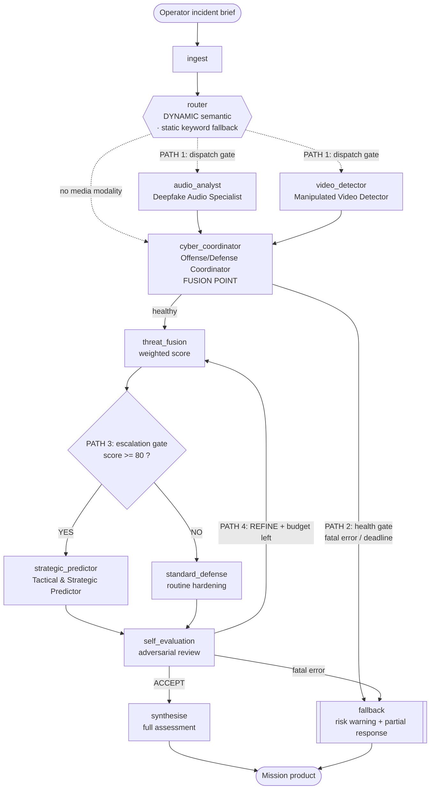

# SENTINEL-4 — Multi-Agent Countermeasure Unit

A Multi-Agent System (MAS) built on **LangGraph** that acts as a digital
countermeasure cell against an advanced rogue AI adversary codenamed
**"The Entity"**. Four specialist agents, coordinated by a dynamic supervisor over
a shared blackboard, analyse deepfake audio, manipulated video and network
intrusion evidence, then produce a verified attack vector, containment actions
and a predictive counter-strategy.

> Course: **ISB 46703 Principles of Artificial Intelligence** · Comprehensive
> Mini-Project: Multi-Agent System Design · Malaysian Institute of Information
> Technology.

**Repository:** <https://github.com/DHARIZMAN/sentinel4-mas>

### Submission documents

| Document | Path | Covers |
|---|---|---|
| **Project Report (PDF)** | [`docs/PROJECT_REPORT.pdf`](docs/PROJECT_REPORT.pdf) | Full report — architecture, prompt design log, workflow justification, robustness analysis, AI declaration, references |
| Report source (HTML) | [`docs/PROJECT_REPORT.html`](docs/PROJECT_REPORT.html) | Editable source; re-render to PDF with **Ctrl+P → Save as PDF** |
| **Presentation deck** | [`docs/PRESENTATION.pptx`](docs/PRESENTATION.pptx) | 16 slides with per-slide speaker notes and demo scripts |
| Architecture diagram | [`docs/architecture.svg`](docs/architecture.svg) · [`.png`](docs/architecture.png) · [`.mermaid`](docs/architecture.mermaid) | Router, agent nodes, 4 conditional edges, state management |

> **Before submitting:** fill in the remaining highlighted placeholders in the report —
> the submission date on the cover page, the AI-usage table (§7.1), and the
> declaration signatures (§10).

---

## 1. Quick start

The system ships with a deterministic **offline engine**, so it runs end to end
with no API key, no GPU and no network.

```bash
git clone https://github.com/DHARIZMAN/sentinel4-mas.git && cd sentinel4-mas
python -m venv venv && source venv/bin/activate      # Windows: venv\Scripts\activate
pip install -r requirements.txt
cp .env.example .env                                  # defaults to MAS_PROVIDER=mock

python main.py --scenario scenarios/scenario_multi_vector.json
```

Docker:

```bash
docker build -t sentinel4-mas .
docker run --rm sentinel4-mas
```

### Run the three shipped scenarios

| Command | Demonstrates |
|---|---|
| `python main.py --scenario scenarios/scenario_multi_vector.json` | All 3 specialists dispatched, score ≥ 80, **escalated** branch |
| `python main.py --scenario scenarios/scenario_audio_only.json` | Dynamic router activates **only** the audio specialist |
| `python main.py --scenario scenarios/scenario_low_threat.json` | Score < 80, **Standard Defense** branch (the ELSE path) |

Ad-hoc input and machine-readable output:

```bash
python main.py --brief "Cloned voice call requesting an MFA reset" --evidence call.wav
python main.py --scenario scenarios/scenario_multi_vector.json --json
```

### Run the failure demonstration (required for the live demo)

```bash
python demo_fallback.py            # all four failure classes
python demo_fallback.py --case 1   # just the endpoint outage
```

### Run the tests

```bash
python -m pytest tests/ -v
python audit_requirements.py       # checks the code against the assessment rubric
```

---

## 2. Architecture



### Collaboration pattern — and why

**Hierarchical supervisor over a shared-state blackboard.** A dynamic supervisor
fans work out to media specialists that run *concurrently*; every report lands on
one `MissionState`; a fusion agent reads the whole board; a conditional gate then
decides whether predictive planning is warranted.

Chosen over the alternatives because:

* **vs. a sequential pipeline** — the audio and video specialists are genuinely
  independent and run in the same super-step, so wall-clock time is set by the
  slower of the two rather than their sum.
* **vs. pure message passing** — the brief's dependency ("the Strategic Predictor
  cannot plan until the Coordinator verifies the attack vector") is a *data*
  dependency. On a blackboard the predictor reads `vector_verified` off shared
  state and refuses to plan without it; with point-to-point messages that
  guarantee has to be re-implemented in every sender.
* **vs. a free-form group chat (AutoGen-style)** — an open conversation has no
  natural termination condition. The explicit graph gives bounded execution,
  which is what makes the loop guard and the fallback budget enforceable.

### The router is DYNAMIC

`src/router.py` performs LLM-driven **semantic intent classification** over the
raw brief and selects specialists from the inferred intent — not from keywords.
It degrades to a deterministic keyword matcher (`static_route`) if the semantic
pass fails, and the mode actually used (`DYNAMIC_SEMANTIC` / `STATIC_FALLBACK`)
is written to the blackboard and printed in every run, so the operator always
knows which one produced the dispatch.

Hallucinated agent names are intersected against `DISPATCHABLE_AGENTS` before
dispatch, and the fusion agent is always included because the escalation gate and
the predictor both depend on it.

### Model-misrouting guard

The brief warns against sending inference calls to an embedding model.
`ModelRegistry` (in `src/config.py`) refuses to start if the configured chat model
name matches any known embedding marker (`embed`, `nomic-embed`, `text-embedding`,
`bge-`, `gte-`, `e5-`), and `resolve("chat")` re-checks on every call.

---

## 3. The agents

| Agent | Role tag | Owns | Explicitly does **not** |
|---|---|---|---|
| **Deepfake Audio Analysis Specialist**<br/>虚假语音识别专员 | `AUDIO_FORENSICS` | Speech-audio authenticity; synthesis indicators | Video, network telemetry, strategy |
| **Manipulated Video Stream Detector**<br/>流视频编辑检测专员 | `VIDEO_FORENSICS` | Frame-level manipulation; manipulation vs. misrepresentation | Audio authenticity, containment |
| **Cyber Offense/Defense Coordinator**<br/>网络攻防专员 | `CYBER_OPS` | Evidence fusion, attack-vector verification, containment **now** | Re-litigating media verdicts; forward planning |
| **Tactical & Strategic Predictor**<br/>敌方战术战略预判及应对策略设计专员 | `STRATEGY` | Adversary next-moves, pre-positioned counter-strategy | Restating containment; planning on an unverified vector |
| *Standard Defense Posture* | `DEFENSE` | The ELSE branch: proportionate routine hardening | Escalation of any kind |

Responsibilities are mutually exclusive by construction: each persona carries an
explicit **STRICT BOUNDARIES** block naming what belongs to someone else.

### Prompt engineering

* **Few-shot prompting** — the Audio Analyst, Video Detector and Cyber
  Coordinator each carry complete Input/Output example pairs. Audio and Video
  carry **two** each, deliberately paired as one positive and one negative case,
  because single-example prompting produced a model that returned `SYNTHETIC` /
  `MANIPULATED` for every artefact and never exercised the inconclusive branch.
* **Format constraints** — every agent inherits `FORMAT_CONTRACT_TEMPLATE`
  (`src/agents/base.py`): a single raw JSON object, no fences, an exact key list,
  integers 0–100 with no units, and an explicit prohibition on `null` or omitted
  keys. The contract is centralised so all agents are held to one standard.

---

## 4. Custom tools (5, against a required minimum of 3)

| Tool | Owner | What it does |
|---|---|---|
| `scan_audio_artifacts` | audio_analyst | Spectral/prosodic forensics → synthesis likelihood + named indicators |
| `check_frame_consistency` | video_detector | Frame-level manipulation artefacts + detector confidence |
| `query_threat_intel` | cyber_coordinator | Mock intelligence lookup (actor, TTPs, severity) with graceful cache-miss |
| `parse_indicators` | shared | **Real** regex IOC extraction: IPv4, domains, CVEs, MD5/SHA-256 |
| `read_evidence_file` | shared | Sandboxed evidence reader with resolved-path containment |

All five are resolved by name through `ToolRegistry`, which is where a
**hallucinated tool** is caught (`HallucinatedToolError`) and downgraded to an
evidence-quality warning rather than an `AttributeError`.

---

## 5. Robustness

| Requirement | Implementation |
|---|---|
| Timeout ≤ 30 s | `Settings.request_timeout`, clamped to 30 s in `load_settings()`; applied on the client **and** per request |
| Retries ≤ 3 | `Settings.max_retries`, clamped to 3; capped exponential back-off (0.4 s → 0.8 s → 1.6 s) |
| ≥ 3 `try/except` blocks | 5+ distinct blocks: `JSONDecodeError` (repair ladder), transport failure, hallucinated tool, `KeyError` on shared state, outermost `GraphRecursionError` net |
| Fallback in < 5 s | `src/fallback.py` makes **no LLM calls** — pure in-process work over the blackboard; measured in single-digit milliseconds and asserted in `tests/test_fallback.py` |
| Loop prevention | Refinement budget (`max_refinement_loops`), graph `recursion_limit=24`, and a 90-second mission deadline — three independent exhaustion modes |

**Fail-safe philosophy.** Agents never raise into the graph: a failed specialist
files a `DEGRADED` report with confidence 0, which the fusion step *excludes*
rather than counting as zero — absence of evidence is not evidence of safety.
When the fusion agent itself fails, the graph diverts to a partial response that
carries an explicit risk warning, everything that was salvaged, a completion
percentage, and an instruction to re-run. The workflow is executed with
`graph.stream()` rather than `invoke()` specifically so that a late loop breach
still salvages the analysis already completed.

---

## 6. Project layout

```
.
├── main.py                     # CLI entry point
├── demo_fallback.py            # live failure-injection demonstration
├── audit_requirements.py       # self-audit against the assessment rubric
├── requirements.txt / Dockerfile / .env.example / .gitignore
├── src/
│   ├── config.py               # settings + embedding-misrouting guard
│   ├── state.py                # MissionState blackboard + reducers
│   ├── llm_client.py           # timeouts, retries, JSON repair, offline engine
│   ├── router.py               # DYNAMIC semantic router + static fallback
│   ├── graph.py                # StateGraph assembly, 4 conditional paths
│   ├── evaluation.py           # threat fusion + adversarial self-evaluation
│   ├── fallback.py             # risk warning + partial response
│   ├── agents/                 # base + 4 specialists + standard defense
│   └── tools/                  # registry + 5 custom tools
├── scenarios/                  # 3 runnable demo scenarios
├── evidence/                   # sandboxed artefacts for read_evidence_file
├── docs/                       # report (PDF + HTML), deck, architecture diagram
└── tests/                      # 35 tests: routing, tools, fallback latency
```

---

## 7. Configuring a real model

Set `MAS_PROVIDER` in `.env`:

* **`mock`** (default) — deterministic offline engine. No key, no network.
* **`local`** — LM Studio / Ollama / vLLM. Set `MAS_LOCAL_BASE_URL` and
  `MAS_LOCAL_CHAT_MODEL` to a **chat/instruct** model id.
* **`remote`** — any hosted OpenAI-compatible endpoint. Set
  `MAS_REMOTE_BASE_URL`, `MAS_REMOTE_API_KEY`, `MAS_REMOTE_CHAT_MODEL`.

> API keys live in `.env`, which is git-ignored. Never commit a key.

---

## 8. AI usage declaration

Generative AI was used to produce the bulk of this implementation, as the
assessment permits and expects. Every location where the human developers
rejected or altered the generated logic is marked in the source with a
`[HUMAN-REVIEW]` comment explaining the reasoning. Run
`grep -rn "HUMAN-REVIEW" src/` to list them. The full declaration, including
which tools were used at which stage and how output was evaluated, is in the
project report.
